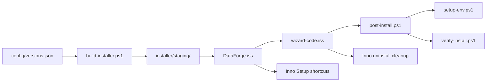
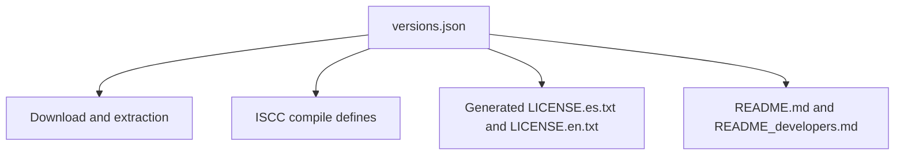
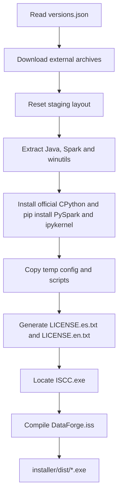
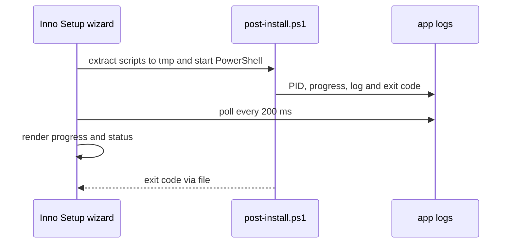
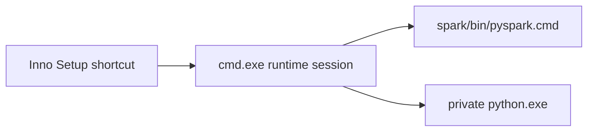

# Arquitectura

## Vista general

DataForge tiene cuatro capas:

1. configuración ejecutable;
2. preparación del payload y empaquetado;
3. instalación, post-instalación y desinstalación;
4. launchers de ejecución para la persona usuaria.

## Mapa de responsabilidades

| Área | Archivo o directorio | Responsabilidad |
| --- | --- | --- |
| Configuración | [`config/versions.json`](../config/versions.json) | Versiones, nombre del producto y fuentes de descarga |
| Fichas generadas | [`config/Update-Readme.ps1`](../config/Update-Readme.ps1) | `README.md` (público) y `README_developers.md` (proceso) desde plantillas |
| Build | [`installer/build-installer.ps1`](../installer/build-installer.ps1) | Descarga, extracción, staging, validación e invocación de ISCC |
| Instalador | [`installer/DataForge.iss`](../installer/DataForge.iss) | Metadatos, archivos, idiomas, iconos, accesos directos y borrado final |
| Wizard | [`installer/wizard-code.iss`](../installer/wizard-code.iss) | UI, proceso asíncrono de post-instalación, cancelación y limpieza |
| Helpers | [`installer/scripts/common.ps1`](../installer/scripts/common.ps1) | Rutas, logging, progreso, PATH, PEP 514 propio y kernelspec |
| Post-instalación | [`installer/scripts/post-install.ps1`](../installer/scripts/post-install.ps1) | Orquestación runtime Python → entorno → verificación |
| Runtime | `java/`, `spark/`, `hadoop/`, `python/` y `LICENSE.txt` | Stack local y aviso de licencias generado en el build |
| Prueba manual | [`installer/test-post-install.ps1`](../installer/test-post-install.ps1) | Ejecutar la post-instalación sin recompilar el ejecutable |

## 1. Configuración como punto de entrada

El build y los scripts instalados leen `config/versions.json`. El archivo
contiene tanto los valores de versión como los detalles de descarga y
extracción. Su función es transversal:

El build traduce sus campos a defines de Inno Setup y genera
`LICENSE.es.txt` y `LICENSE.en.txt` (aviso de copyright y licencias de los
componentes empaquetados). El texto propio de DataForge va en el idioma del
archivo; las licencias de terceros quedan en su idioma original.
Los scripts PowerShell leen la configuración extraída a `{tmp}` solo
durante la post-instalación; los accesos directos usan los defines y no retienen
la configuración como dependencia de runtime. Por tanto, un valor de versión no
debe tener una segunda fuente canónica.

## 2. Pipeline de build y staging

[`build-installer.ps1`](../installer/build-installer.ps1) es el orquestador de
build y acepta tres controles:

- `-SkipDownload`: reutiliza un staging existente tras validar sus archivos
  mínimos;
- `-SkipCompile`: prepara staging sin generar el ejecutable;
- `-InnoSetupCompiler`: indica una ruta explícita a `ISCC.exe`.

El flujo normal es:

El staging se reconstruye con las carpetas `java`, `spark`, `hadoop`, `python`,
`config` y `scripts`, además de `LICENSE.es.txt` y `LICENSE.en.txt`. Los binarios de Java,
Spark, winutils y el prefijo CPython con PySpark e ipykernel se copian al staging.
`config/` y `scripts/` se empaquetan en el `.exe` pero no se copian a `{app}`:
el wizard los extrae a `{tmp}` solo mientras corre la post-instalación.

Los directorios `installer/downloads/`, `installer/staging/` e
`installer/dist/` son productos generados y están excluidos de Git. El prefijo
Python de build se genera en `downloads/python-root` y se copia a
`staging/python`. El instalador oficial de python.org no forma parte del
payload del usuario. Ese instalador es un producto per-user único: si
Windows Installer aún registra un prefijo de build anterior (por ejemplo
tras mover el repo) el `/quiet` no materializa archivos. El build restaura
ese prefijo si faltan archivos, lo desinstala y vuelve a instalar. No
desinstala un CPython ajeno con `python.exe` presente.

## 3. Empaquetado e interacción de Inno Setup

[`DataForge.iss`](../installer/DataForge.iss) recibe los defines del
build, empaqueta el staging y declara:

- instalación para Windows x64;
- interfaz en español e inglés;
- `LicenseFile` por idioma (`LICENSE.es.txt` o `LICENSE.en.txt`) en la página de aceptación; el idioma elegido se copia a `{app}` como `LICENSE.txt`;
- archivos, accesos directos y ejecución opcional de Apache Spark shell;
- directivas de borrado de la instalación;
- inclusión de [`wizard-code.iss`](../installer/wizard-code.iss).

El wizard no bloquea la interfaz mientras se configura el entorno. En su lugar,
extrae `post-install.ps1` y la configuración a `{tmp}`, inicia PowerShell
desde ahí y coordina el estado a través de archivos dentro de `{app}\logs`.
Los scripts no aparecen en el directorio de instalación.

Antes de copiar archivos, [`wizard-code.iss`](../installer/wizard-code.iss)
consulta la clave de desinstalación del `AppId` en ambos hives. Una copia en
el mismo ámbito se reemplaza en su carpeta (sin página de directorio). Una
copia en el otro ámbito aborta el Setup. `/DIR=` no puede crear un segundo
árbol.

Los archivos de coordinación son el PID, la señal de cancelación, el progreso,
el código de salida y el log. La cancelación crea la señal y termina el árbol
del proceso de post-instalación sin esperar de forma indefinida a `taskkill`
ni a procesos Java/Python huérfanos bajo `{app}`; el script PowerShell trata
`INSTALL_CANCELLED` como el código de salida 1602. Si la configuración falla,
el wizard deja **Cerrar** habilitado: conservar archivos termina Setup fuera
del manejador de cancelación, y eliminarlos mata antes el runtime para que el
rollback no se quede esperando archivos en uso. El memo de la UI trunca
volcados grandes; el detalle completo queda en `logs/install.log`.

## 4. Post-instalación

El orquestador PowerShell ejecuta tres pasos secuenciales:

### 4.1 Runtime Python privado

Inno Setup copia el prefijo CPython a `{app}\python`. Ese prefijo incluye
PySpark e ipykernel resueltos en el build. La post-instalación comprueba que
`python.exe` existe. No se ejecuta el instalador de python.org en el PC y no se
resuelven paquetes en PyPI. El descubrimiento para VS Code y Jupyter se registra
en el paso de entorno: clave PEP 514 propia y kernelspec de usuario con ruta
absoluta, sin `ipykernel install` ni `py.exe`.

Los lanzadores de pip en `python\Scripts` pueden conservar el prefijo de
build; el producto usa `python.exe` y `python -m pip`, no esos `.exe`.

### 4.2 Variables de entorno

[`setup-env.ps1`](../installer/scripts/setup-env.ps1) escribe variables en el
ámbito de usuario y actualiza la sesión que ejecuta el script. Todas las rutas
que añade al `PATH` se persisten como valores absolutos bajo el directorio de
instalación: Java, Spark, Hadoop y `{app}\python`. Esto evita que `cmd.exe`
reciba referencias anidadas sin expandir, como `%SPARK_HOME%\bin`, y no
encuentre los binarios correspondientes. Antes de escribir las nuevas entradas,
elimina las que viven bajo el directorio actual y, si `DATAFORGE_HOME`
apunta a otra carpeta, las de esa raíz anterior, además de las
referencias expandibles heredadas.

A continuación registra el CPython copiado para herramientas que descubren
intérpretes por PEP 514 o por kernelspecs de Jupyter. La clave vive en
`HKCU\Software\Python\<producto>`, no en `PythonCore`. El kernelspec de usuario
usa `{app}\python\python.exe` en `argv`, y se reescribe el `kernel.json` del
prefijo para que no conserve el comando genérico `python`.

### 4.3 Verificación

[`verify-install.ps1`](../installer/scripts/verify-install.ps1):

- comprueba la presencia de `java.exe`, `winutils.exe`, `spark-submit.cmd` y
  el Python privado;
- comprueba que el registro PEP 514 propio y el kernelspec de usuario apuntan
  a ese `python.exe`;
- ejecuta `java -version`;
- lanza un código Python que importa `ipykernel`, importa PySpark, crea una
  `SparkSession` con `master('local[*]')`, comprueba las versiones y espera
  las salidas `OK_IPYKERNEL` y `OK`.

Esta es la verificación funcional que permite marcar la instalación como
exitosa.

## 5. Runtime de usuario

Los accesos directos de Inno Setup abren `cmd.exe` con una sesión local que
define las rutas de Java, Spark, Hadoop y el Python privado.

Además, `setup-env.ps1` persiste las variables y rutas absolutas para terminales
nuevas. `LICENSE.txt` queda como aviso de licencias y versiones de esa copia,
en el idioma elegido en el wizard, y no se consulta para lanzar PySpark.

## 6. Desinstalación

La ruta activa vive en `wizard-code.iss`:

1. elimina variables de entorno de usuario;
2. filtra las entradas de `PATH` propias;
3. elimina el registro PEP 514 propio y el kernelspec de usuario;
4. elimina el CPython privado;
5. deja que `[UninstallDelete]` elimine el resto de directorios instalados.

[`uninstall-env.ps1`](../installer/scripts/uninstall-env.ps1) contiene una
implementación PowerShell similar, pero no es invocado por el `.iss` actual.
Esto representa una utilidad o ruta alternativa no integrada; cualquier cambio
de desinstalación debe considerar el riesgo de divergencia entre ambas
implementaciones.

## 7. Efectos externos y recuperación

| Recurso | Alta | Baja o fallo |
| --- | --- | --- |
| Directorio de instalación | Inno copia Java, Spark, Hadoop, Python y `LICENSE.txt`; la post-instalación no crea un runtime Python adicional | Tras éxito y avance en el wizard quedan los cuatro directorios de runtime, `LICENSE.txt` y `unins*`; en fallo se conservan `logs/` y el runtime copiado. `scripts/` y `config/` no se escriben en `{app}` |
| `HKCU\Environment` | Se crean variables propias del runtime | Se eliminan durante la desinstalación |
| `HKCU\Software\Python\<producto>` | PEP 514 del CPython privado; no se escribe `PythonCore` | Se elimina la clave de empresa propia |
| Kernelspec de usuario | `%APPDATA%\jupyter\kernels\<producto>` con `argv` absoluto | Se elimina el directorio del kernel |
| `PATH` de usuario | Se añaden rutas absolutas propias, se migran referencias heredadas y se retiran entradas de un hogar anterior | Se filtran las rutas propias durante la desinstalación |
| Logs | Se usan para progreso y diagnóstico | Se eliminan al avanzar desde el éxito; permanecen ante fallo |

La arquitectura persigue un efecto reversible, aunque las rutas protegidas o
una cancelación forzada pueden requerir diagnóstico manual. Los riesgos y
cobertura conocida se mantienen en [Estado del proyecto](PROJECT_STATUS.md).

## 8. Dependencias externas

| Fase | Dependencias |
| --- | --- |
| Build | Red, `curl.exe`, `tar`, `Expand-Archive`, Inno Setup, instalador oficial de CPython y PyPI |
| Instalación | Windows PowerShell y el payload copiado (Java, Spark, winutils, CPython con PySpark) |
| Ejecución | Java, Spark, winutils y el Python preparados por la instalación |

El build descarga algunos recursos desde URLs configuradas, incluidas fuentes
que pueden evolucionar. En el estado actual no hay una verificación de
checksum integrada; una entrega debe validar las fuentes conforme al proceso de
[Desarrollo y release](DEVELOPMENT_AND_RELEASE.md).
